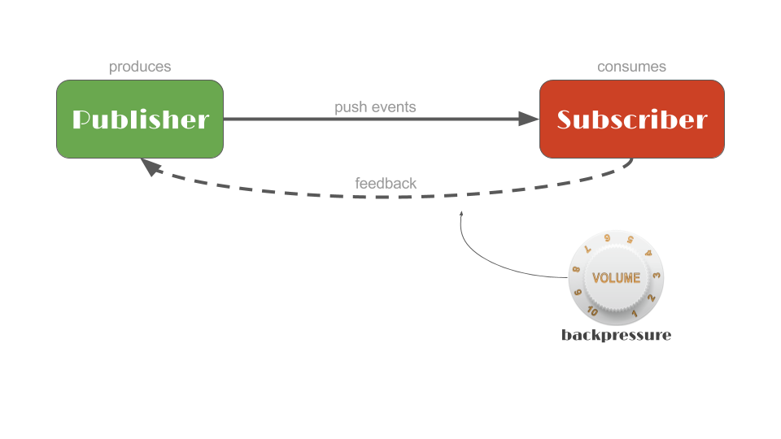
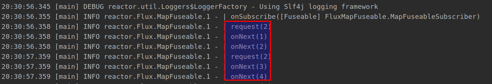
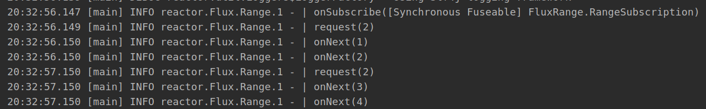
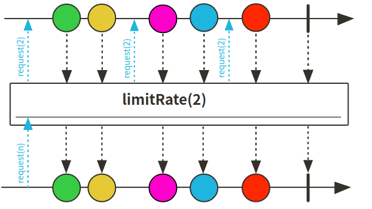
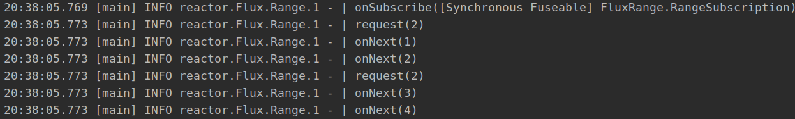

# Reactor 3 （6）: 背压 Backpressure 使用



有这样的情况，上游传递到下游的数据需要进行处理，然而上游推送的速度又很快，下游由于资源等原因来不及处理；如果这时还是通过不限制上游速度的方式推送数据，就会出问题，因此Reactive Streams有两一种处理方式，就是通过request的机制向上游传递信号，并指定接收数量；通过这种方法将**push**模型转化为**push-pull hybrid**，这就是backpressure的用法。

## 通过编写Subscriber实现backpressure

下面介绍backpressure比较原始的写法，通过构建Subscriber控制request的大小：

```java
@Test
public void rawBackPressure () {
    Flux<String> flux = Flux.range(1,10)
            .map(i -> String.valueOf(i))
            .log();

    flux.subscribe(new Subscriber<String>() {
        private int count = 0;
        private Subscription subscription;
        private int requestCount = 2;

        @Override
        public void onSubscribe(Subscription s) {
            this.subscription = s;
            s.request(requestCount);  // 启动
        }

        @SneakyThrows
        @Override
        public void onNext(String s) {
            count++;
            if (count == requestCount) {  // 通过count控制每次request两个元素
                Thread.sleep(1000);
                subscription.request(requestCount);
                count = 0;
            }
        }

        @Override
        public void onError(Throwable t) {

        }

        @Override
        public void onComplete() {

        }
    });
}
```

+ 通过使用count对控制request的触发
+ 指定每次request的大小，实际生产中可以根据资源情况动态调节



## 通过编写BaseSubscriber实现backpressure

+ 可以使用功能更多的BaseSubscriber类处理背压逻辑，因为BaseSubscriber的一些方法可以简化处理的逻辑

```java
@Test
public void baseBackPressure () {
    Flux<Integer> flux = Flux.range(1,10).log();
    
    flux.subscribe(new BaseSubscriber<Integer>() {
        private int count = 0;
        private final int requestCount = 2;

        @Override
        protected void hookOnSubscribe(Subscription subscription) {
            request(requestCount);
        }

        @SneakyThrows
        @Override
        protected void hookOnNext(Integer value) {
            count++;
            if (count == requestCount) {  // 通过count控制每次request两个元素
                Thread.sleep(1000);
                request(requestCount);
                count = 0;
            }
        }
    });
}
```



运行结果一样，request(2)之后执行两个next

## 通过使用limitRate()方法实现



+ 通过flux的limitrate方式实现调整request数量

```java
@Test
public void backPressureLimitRate(){
    Flux.range(1,10)
            .log()
            .limitRate(2)
            .subscribe();
}
```

运行结果跟上面一样：



代码