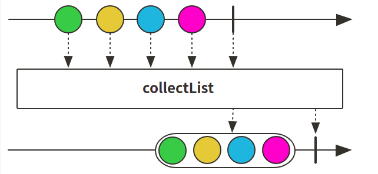

# Reactor 3 （13）: 数据收集 collect


有的时候流数据有需要转化为其他类型数据，同Stream相同，Reactor也有将数据进行收集的方法：

+ collect () : 将数据根据给出的collector进行收集
+ collectList() : 收集收集为list形式
+ collectSortedList():  数据收集为list并排序，需要给出排序规则
+ collectMap(): 数据收集为Map形式，是key，value形式，因此如果有重复key会覆盖
+ collectMultimap(): 数据收集为Map形式，是key，collection形式，如果有重复key值写在list中


## collect()方法

### 图示：


### 代码示例：

+ 需要注意的是收集后的为Mono

```java
    @Test
    public void collectTest() {
        Mono<Set<String>> flux = Flux.just("ffzs", "vincent", "tony", "sleepycate")
                .collect(Collectors.toSet())
                .log();

        flux.subscribe();
    }
```


## collectList() 方法

### 图示：



### 代码示例：

+ 直接收集为Mono<List<>>

```java
@Test
public void collectListTest() {
    Flux.just("ffzs", "vincent", "tony", "sleepycate")
            .collectList()
            .log()
            .subscribe();
}
```


## collectSortedList()方法

### 代码示例：

```java
@Test
public void collectSortedListTest() {
    Flux.just("ffzs", "vincent", "tony", "sleepycate")
            .collectSortedList(Comparator.comparing(String::length))
            .log()
            .subscribe();
}
```


结果为排过顺序的。

## collectMap()方法


### 代码示例：

+ 根据字符串的长度作为key

```java
@Test
public void collectMapTest() {
    Flux.just("ffzs", "vincent", "tony", "sleepycate")
            .collectMap(String::length)
            .log()
            .subscribe();
}
```


由于 ffzs和tony长度都是4,因此ffzs被tony覆盖掉了

## collectMultimap()方法


### 代码示例：

```java
@Test
public void collectMultimapTest() {
    Flux.just("ffzs", "vincent", "tony", "sleepycate")
            .collectMultimap(String::length)
            .log()
            .subscribe();
}
```


所有数据都收集到collection中


## 代码

github