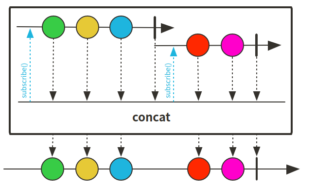
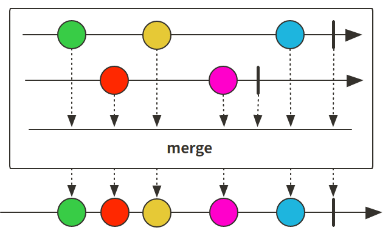
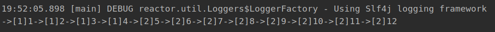
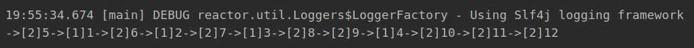
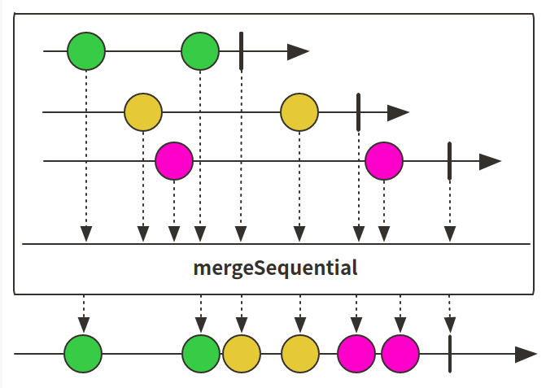
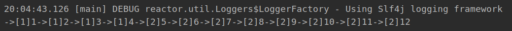
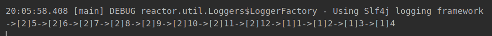
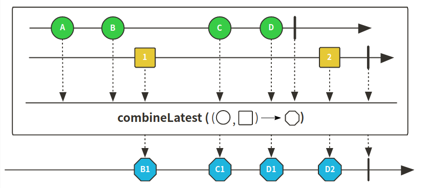
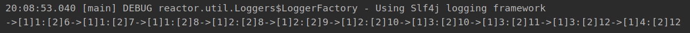

# Reactor 3 （10）: 数据合并concat、merge


由于业务需求有的时候需要将多个数据源进行合并，Reactor提供了concat方法和merge方法：

concat方法示意图：



merge方法示意图：



从图中可以很清楚的看出这两种合并方法的不同：

+ concat是合并的flux，按照顺序分别运行，flux1运行完成以后再运行flux2
+ merge是同时运行，根据时间先后运行

下面对concat和merge相关的方法进行测试，先准备测试数据：

```java
private Flux<Integer> flux1() {
    return Flux.range(1,4);
}

private Flux<Integer> flux2() {
    return Flux.range(5,8);
}


private Flux<String> hotFlux1() {
    return flux1().map(i-> "[1]"+i).delayElements(Duration.ofMillis(10));
}

private Flux<String> hotFlux2() {
    return flux2().map(i-> "[2]"+i).delayElements(Duration.ofMillis(4));
}
```

## concat相关方法

### concat代码演示

```java
    @Test
    public void concatTest() throws InterruptedException {

        Flux.concat(hotFlux1(), hotFlux2())
                .subscribe(i -> System.out.print("->"+i));

        Thread.sleep(200);
    }
```

### 运行结果

+ 从结果可以看出先运行完flux1之后再运行flux2



### concatWith方法

用法和concat基本相同，写法略有不同：

```java
@Test
public void concatWithTest () {
    flux1().concatWith(flux2())
            .log()
            .subscribe();
}
```

## merge相关方法

### merge代码演示

```java
@Test
public void mergeTest() throws InterruptedException {

    Flux.merge(hotFlux1(), hotFlux2())
            .subscribe(i -> System.out.print("->"+i));

    Thread.sleep(200);
}
```

### 运行结果

+ 很明显顺序和concat的区别，是按照时间先后执行



### mergeWith用法

+ 用法和merge相同，写法不同而已

```java
@Test
public void mergeWithTest() throws InterruptedException {

    hotFlux1().mergeWith(hotFlux2())
            .subscribe(i -> System.out.print("->"+i));

    Thread.sleep(200);
}
```

### mergeSequential用法



+ 跟concat有些相似，得到的结果类似
+ 跟concat不同在于，订阅的源是hot型，接收数据后根据订阅顺序重新排序

```java
@Test
public void mergeSequentialTest() throws InterruptedException {
    Flux.mergeSequential(hotFlux1(), hotFlux2())
            .subscribe(i -> System.out.print("->"+i));

    Thread.sleep(200);
}
```



结果和concat的一样都是

### mergeOrdered用法

+ 合并接收之后再排序

```java
    @Test
    public void mergeOrderedTest() throws InterruptedException {

        Flux.mergeOrdered(Comparator.reverseOrder(), hotFlux1(), hotFlux2())
                .subscribe(i -> System.out.print("->"+i));

        Thread.sleep(200);
    }
```



## combineLatest用法



+ 跟concat和merge不同该方法是将多个源的最后得到元素通过函数进行融合的到新的值

### 代码示例

```java
@Test
public void combineLatestTest() throws InterruptedException {

    Flux.combineLatest(hotFlux1(), hotFlux2(), (v1, v2) -> v1 + ":" + v2)
            .subscribe(i -> System.out.print("->"+i));

    Thread.sleep(200);
}
```

### 运行结果

+ 结果都是flux1和flux2中元素进行融合之后的元素




## 代码

[github](https://github.com/ffzs/learn_reactor/tree/master/src/main/java/ConcatMergeTest)

[gitee](https://gitee.com/ffzs/learn_reactor/tree/master/src/main/java/ConcatMergeTest)

