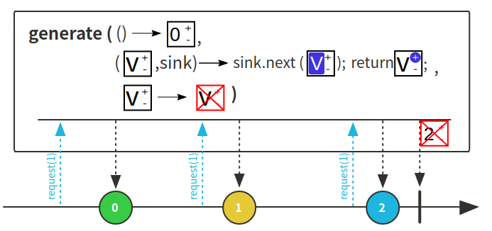
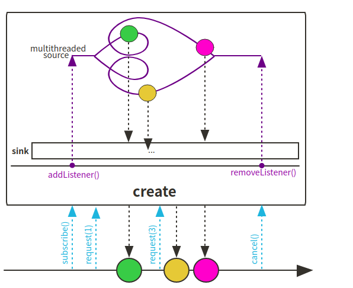

# Reactor 3 （7）: 通过create()、generate()生成publisher

之前文章也介绍过了Mono和Flux的静态创建方法，这里有两种方法能够更加随意的生成Mono或是Flux：

+ create(): 该方法可以用来创建flux和mono，通过出入一个callback函数用来对sink进行操作，添加sink的元素，create可以获取回调中发生的多线程事件，比如桥接一些异步多值得api
+ generate(): 该方法只能用来生成Flux，相对create而言，generate在创建过程可以持久化一个state变量记录一些状态，类似闭包结构，通过一个回调函数进行对sink的操作，还可以对最后的state进行处理。当然generate可以像create一样使用


## generate()方法使用



### 使用generate()创建Flux代码

```java
@Test
public void generateFlux() {
    Flux<Object> flux = Flux.
            generate(
                ()-> 0,
                (i, sink) -> {
                    sink.next(i*i);
                    if (i == 5) sink.complete();
                    return ++i;
                },
                state -> log.warn("the final state is:{}", state)
            ).
            log();

    flux.subscribe();
}
```

## create() 方法使用



### 使用create()创建Mono代码

```java
    @Test
    public void createMono() {
        Mono<Object> mono = Mono
                .create(sink -> {
                    List<Integer> list = new ArrayList<>();
                    for (int i = 0; i < 5; i++) {
                        list.add(i);
                    }
                    sink.success(list);
                })
                .log();

        StepVerifier.create(mono)
                .expectSubscription()
                .expectNext(Arrays.asList(0,1,2,3,4))
                .verifyComplete();
    }
```

### 使用create()创建Flux代码

```java
@Test
public void createFlux() {
    Flux<Object> flux = Flux
            .create(sink -> {
                for (int i = 0; i < 5 ; i++) {
                    sink.next(i*i);
                }
                sink.error(new RuntimeException("fake a mistake"));
                sink.complete();
            })
            .log();

    StepVerifier.create(flux)
            .expectSubscription()
            .expectNext(0,1,4,9,16)
            .expectError(RuntimeException.class)
            .verify();
}
```


代码