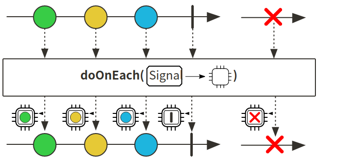
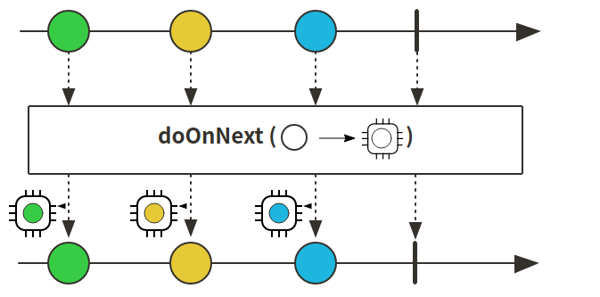
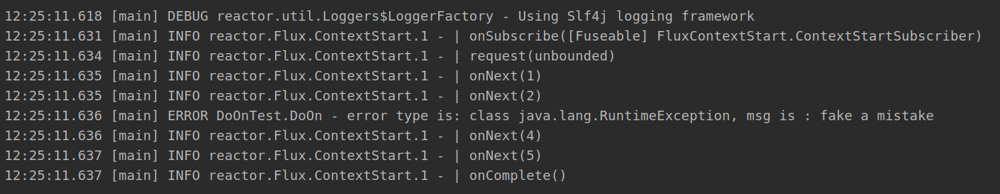

# Reactor 3 （4）:   监控与副作用 doOn 系列方法

在Publisher使用subscribe()方法的时候，Subscriber触发回触发一系列的on方法，如onSubscribe()；为了更好的监控以及观测异步序列的传递情况，设置了一系列的doOn方法，在触发on方法的时候作behavior的副作用发生用于监控行为的运行情况

## 常见doOn方法

+ doOnEach(): 对每一个元素对应的single对象进行监控
+ 
+ doOnSubscribe(): 用以监控onSubscribe()方法的执行
+ doOnRequest：对request行为监控产生副作用
+ doOnNext：onNext副作用
+ 
+ doOnError：出现error时的副作用，用于监控报错，可以通过错误类型进行筛选
+ doOnComplete：完成时触犯
+ doOnCancel：取消时触发
+ doOnTerminate：终止时触发，无论是成功还是出现异常

一下为部分代码实现：

```java
    @Test
    public void doOnWithMono () {
        Mono.just("ffzs")
                .map(String::toUpperCase)
                .doOnSubscribe(subscription -> log.info("test do on subscribe"))
                .doOnRequest(longNumber -> log.info("test do on request"))
                .doOnNext(next -> log.info("test do on next1, value is {}", next))
                .map(String::toLowerCase)
                .doOnNext(next -> log.info("test do on next2, value is {}", next))
                .doOnSuccess(success -> log.info("test do on success: {}", success))
                .subscribe();
    }

    @Test
    public void doOnWithFlux () {
        Flux.range(1,10)
                .map(i -> {
                    if (i == 3) throw new RuntimeException("fake a mistake");
                    else return String.valueOf(i);
                })
                .doOnError(error -> log.error("test do on error, error msg is: {}", error.getMessage()))
                .doOnEach(info -> log.info("do on Each: {}", info.get()))
                .doOnComplete(() -> log.info("test do on complete"))  // 因为error没有完成不触发
                .doOnTerminate(() -> log.info("test do on terminate"))  // 无论完成与否，只要终止就触发
                .subscribe();
    }
```


## 集成监控 log()方法

reactor提供了一个很便利的监控方法：log()

在编写publisher的时候加上log，在subscriber调用的时候会将触发的每一个behavior以日志的形式打印出来：

看个小栗子：

```java
@Test
public void logTest () {
    Flux.range(1,5)
            .map(i -> {
                if (i == 3) throw new RuntimeException("fake a mistake");
                else return String.valueOf(i);
            })
            .onErrorContinue((e, val) -> log.error("error type is: {}, msg is : {}", e.getClass(), e.getMessage()))
            .log()
            .subscribe();
}
```

效果如下，日志内容很详细，线程使用，onNext，request这些都会标明




代码