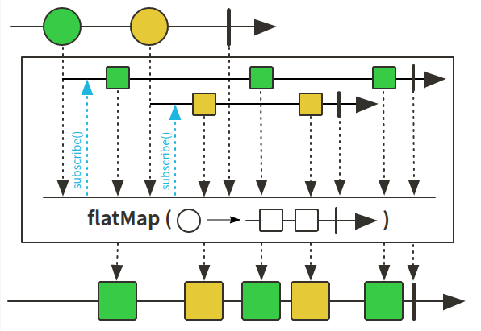
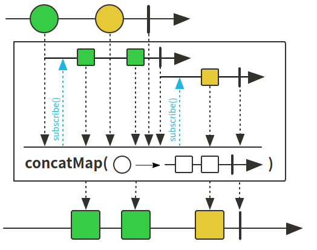
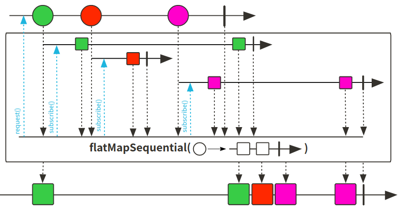

# Reactor 3 （11）: 数据扁平处理flatMap、concatMap


在Stream中我们可以通过flatMap将多维数据打开降维，扁平化处理数据为一维数据。Reactor当然也有这种需求，我们可以使用flatMap和concatMap进行数据的降维处理


## flatMap、concatMap用法比对

flatMap示意图：



concatMap示意图：



flatMapSequential示意图：



根据示意图可以清楚的看出这三个方法的异同：

+ flatMap和flatMapSequential的订阅是同时进行的，而concatMap的是有先后顺序的
+ concatMap和flatMapSequential的值是跟源中值顺序相同，其中flatMapSequential是经过后排序，二者输出相同
+ flatMap中的值是交错的，根据事件触发


## 测试代码：

```java
import lombok.extern.slf4j.Slf4j;
import org.junit.jupiter.api.Test;
import reactor.core.publisher.Flux;

import java.time.Duration;
import java.util.Arrays;

/**
 * @author: ffzs
 * @Date: 2020/8/7 下午8:18
 */

@Slf4j
public class FlatMapTest {

    @Test
    public void flatMap () throws InterruptedException {
        Flux.just("abcd", "ffzs")
                .flatMap(i -> Flux.fromArray(i.split("")).delayElements(Duration.ofMillis(10)))
                .subscribe(i -> System.out.print("->"+i));
        Thread.sleep(100);
    }

    @Test
    public void flatMapSequential () throws InterruptedException {
        Flux.just("abcd", "ffzs")
                .flatMapSequential(i -> Flux.fromArray(i.split("")).delayElements(Duration.ofMillis(10)))
                .subscribe(i -> System.out.print("->"+i));
        Thread.sleep(100);
    }

    @Test
    public void flatMapIterable () {
        Flux.just("abcd", "ffzs")
                .flatMapIterable(i -> Arrays.asList(i.split("")))
                .subscribe(i -> System.out.print("->"+i));
    }

    @Test
    public void concatMap () throws InterruptedException {
        Flux.just("abcd", "ffzs")
                .concatMap(i -> Flux.fromArray(i.split("")).delayElements(Duration.ofMillis(10)))
                .subscribe(i -> System.out.print("->"+i));
        Thread.sleep(110);
    }

    @Test
    public void concatMapIterable () {
        Flux.just("abcd", "ffzs")
                .concatMapIterable(i -> Arrays.asList(i.split("")))
                .subscribe(i -> System.out.print("->"+i));
    }
}
```


## 代码：

[github](https://github.com/ffzs/learn_reactor/tree/master/src/main/java/FlatMapTest)

[gitee](https://gitee.com/ffzs/learn_reactor/tree/master/src/main/java/FlatMapTest)

