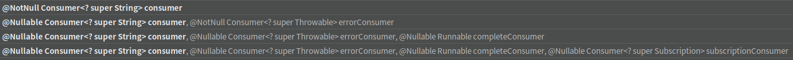

## Reactor 3 （3）: 创建Publisher之Flux


## 创建Flux

上一篇介绍了Mono，mono表示0-1的序列，flux用来表示0-N个元素序列，mono是flux的简化版，flux可以用来表示流

因为是表示连续序列Flux和Mono的创建方法，有些不同，下面是flux的一些创建方法：

+ just()：可以指定序列中包含的全部元素。
+ range(): 可以用来创建连续数值
+ empty()：创建一个不包含任何元素。
+ error(Throwable error)：创建一个只包含错误消息的序列。
+ fromIterable(): 通过迭代器创建如list，set
+ fromStream(): 通过流创建
+ fromArray(T[]): 通过列表创建 如 String[], Integer[]
+ merge(): 通过将两个flux合并得到新的flux
+ interval(): 每隔一段时间生成一个数字，从1开始递增

如下为创建flux示例：

```java
    @Test
    public void flux () throws InterruptedException {
        Flux<Integer> intFlux = Flux.just(1, 2, 3, 4, 5);
        Flux<Integer> rangeFlux = Flux.range(6, 4);  // 以6开始，取4个值：6,7,8,9
        Flux.fromArray(new Integer[]{1,3,4,5,6,12}).subscribe(System.out::println);  // 通过fromArray构建
        Flux<String> strFluxFromStream = Flux.fromStream(Stream.of("just", "test", "reactor", "Flux", "and", "Mono"));
        Flux<String> strFluxFromList = Flux.fromIterable(Arrays.asList("just", "test", "reactor", "Flux", "and", "Mono"));
        // 通过merge合并
        Flux<String> strMerge = Flux.merge(strFluxFromStream, strFluxFromList);
        Flux<Integer> intFluxMerged = Flux.merge(intFlux, rangeFlux);
        strMerge.subscribe(log::info);
        intFluxMerged.subscribe(i -> log.info("{}", i));
        // 通过interval创建流数据
        Flux.interval(Duration.ofMillis(100)).map(String::valueOf)
                .subscribe(log::info);
        Thread.sleep(2000);
    }
```


## subscribe方法使用

subscribe方法最多可以传入四个参数：



```java
    @Test
    public void subscribe () throws InterruptedException {
        Flux
                .interval(Duration.ofMillis(100))
                .map(i -> {
                    if (i == 3) throw new RuntimeException("fake a mistake");
                    else return String.valueOf(i);
                })
                .subscribe(info -> log.info("info： {}", info), // 参数1, 接受内容
                        err -> log.error("error: {}", err.getMessage()),  // 参数2， 对err处理的lambda函数
                        () -> log.info("Done"),   // 参数3, 完成subscribe之后执行的lambda函数u
                        sub -> sub.request(10));  // 参数4, Subscription操作, 设定从源头获取元素的个数

        Thread.sleep(2000);
    }
```

