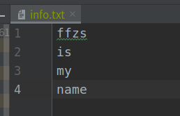
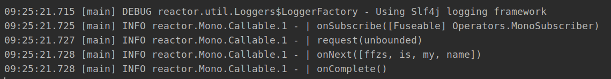
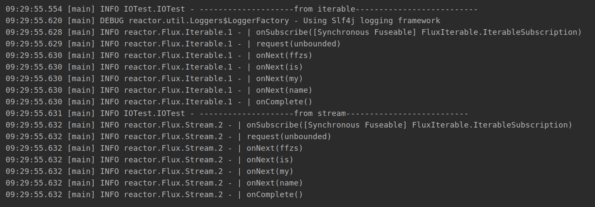
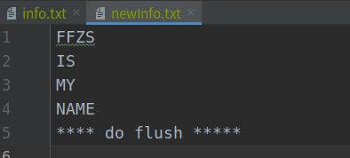
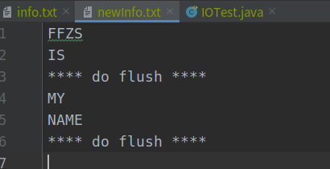

# Reactor 3 （7）:  I/O 处理

无论是使用webflux还是reactor都有访问文件获取数据的需求，这里简单介绍reactor读写文件的方法：

项目目录下准备一个文件命名info.txt，随便写点什么东西：



## Mono读文件

+ mono可以通过callable进行文件的读取
+ 因为mono元素只能是0或1个，这里通过Files的readAllLines方法获取list

```java
@Test
public void monoRead() {
    Mono.fromCallable(()-> Files.readAllLines(Paths.get("info.txt")))
            .log()
            .subscribe();
}
```

运行结果如下




## Flux读文件

两种方法：

+ 通过Files的readAllLines方法获取list，在由Flux的fromIterable接收
+ 通过Files的lines方法活的stream；再由Flux的fromStream接收

```java
    @Test
    public void FluxRead() throws IOException{
        log.info("--------------------from iterable--------------------------");
        Flux.fromIterable(Files.readAllLines(Paths.get("info.txt")))
                .log()
                .subscribe();

        log.info("--------------------from stream--------------------------");
        Flux.fromStream(Files.lines(Paths.get("info.txt")))
                .log()
                .subscribe();
    }
```
两种方法运行结果都一样，不过第一种方法是全部读取完成之后再处理，第二种方法是流式处理，文件大的话第一种方法会内存消耗过大，推荐使用第二种方法：



## 通过Subscriber写入文件

文件有读就有写，写的处理要在subscribe时进行

+ 构建BaseSubscriber对象，通过BufferedWriter，每次onNext的时候将value写入文件
+ 在onComplete的时候flush并关闭

```java
    @Test
    public void baseWrite() throws IOException {

        Flux<String> flux = Flux.fromStream(Files.lines(Paths.get("info.txt")))
                .map(String::toUpperCase)
                .log();

        flux.subscribe(new BaseSubscriber<String>() {
            BufferedWriter bw = Files.newBufferedWriter(Paths.get("newInfo.txt"));

            @SneakyThrows
            @Override
            protected void hookOnNext(String value) {
                bw.write(value + "\n");
            }

            @SneakyThrows
            @Override
            protected void hookOnComplete() {
                bw.flush();
                bw.write("**** do flush **** \n");
                bw.close();
            }
        });
    }

```



+ 如果文件比较大的话，在关闭的时候flush显然不是很合理
+ 通过计数，写入一定行数之后清理buffer进行flush操作

```java
@Test
public void flushWrite() throws IOException {
    Flux<String> flux = Flux.fromStream(Files.lines(Paths.get("info.txt")))
            .map(String::toUpperCase)
            .log();

    flux.subscribe(new BaseSubscriber<String>() {
        BufferedWriter bw = Files.newBufferedWriter(Paths.get("newInfo.txt"));
        private int count = 0;
        @SneakyThrows
        @Override
        protected void hookOnNext(String value) {
            count++;
            bw.write(value + "\n");
            if (count % 2 == 0) {       // 设定行数进行清理缓存写入文件
                bw.write("**** do flush **** \n");
                bw.flush();
            }
        }
        @SneakyThrows
        @Override
        protected void hookOnComplete() {
            bw.close();
        }
    });
}
```

上面设置每两行进行一次flush：



代码

