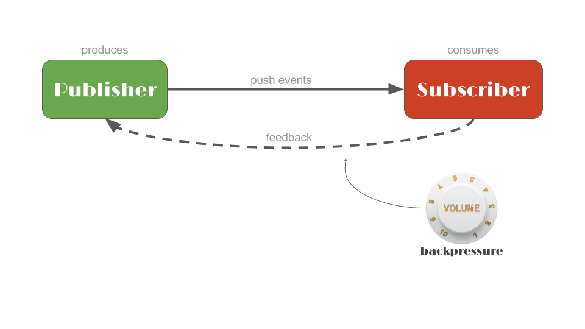

# Reactor 3 （2）: 创建Publisher之Mono



## Reactor中的Publisher

Reactor中有两种Publisher：Flux和Mono，其中Flux用来表示0~N个元素的异步序列，Mono用来表示0~1个元素的异步序列，相对于Flux而言Mono更简单一些。


## 创建Mono

reactor中的mono可以通过一些方法创建，常用方法如下：

+ just()：可以指定序列中包含的全部元素。
+ empty()：创建一个不包含任何元素。
+ error(Throwable error)：创建一个只包含错误消息的序列。
+ fromCallable()、fromCompletionStage()、fromFuture()、fromRunnable()和 fromSupplier()：分别从 Callable、CompletionStage、CompletableFuture、Runnable 和 Supplier 中创建 Mono。
+ delay(Duration duration)：创建一个 Mono 序列，在指定的延迟时间之后，产生数字 0 作为唯一值。
+ ignoreElements(Publisher source)：创建一个 Mono 序列，忽略作为源的 Publisher 中的所有元素，只产生结束消息。
+ justOrEmpty(Optional<? extends T> data)和 justOrEmpty(T data)：从一个 Optional 对象或可能为 null 的对象中创建 Mono。只有 Optional 对象中包含值或对象不为 null 时，Mono 序列才产生对应的元素。


```java
import lombok.extern.slf4j.Slf4j;
import org.junit.jupiter.api.Test;
import reactor.core.publisher.Flux;
import reactor.core.publisher.Mono;

import java.time.Duration;
import java.util.Date;
import java.util.concurrent.CompletableFuture;

/**
 * @author: ffzs
 * @Date: 2020/8/5 下午3:57
 */

@Slf4j
public class MonoTest {

    @Test
    public void mono() {
        // 通过just直接赋值
        Mono.just("my name is ffzs").subscribe(log::info);
        // empty 创建空mono
        Mono.empty().subscribe();
        // 延迟生成0
        Mono.delay(Duration.ofMillis(2)).map(String::valueOf).subscribe(log::info);
        // 通过Callable
        Mono.fromCallable(() -> "callback function").subscribe(log::info);
        // future
        Mono.fromFuture(CompletableFuture.completedFuture("from future")).subscribe(log::info);
        // 通过runnable
        Mono<Void> runnableMono = Mono.fromRunnable(() -> log.warn(Thread.currentThread().getName()));
        runnableMono.subscribe();
        // 通过使用 Supplier
        Mono.fromSupplier(() -> new Date().toString()).subscribe(log::info);
        // flux中
        Mono.from(Flux.just("from", "flux")).subscribe(log::info);  // 只返回flux第一个
    }
}

```

下面是运行结果：


## 使用StepVerifier测试

+ 通过`expectNext`执行类似断言的功能

```java
    @Test
    public void StepVerifier () {
        Mono<String> mono = Mono.just("ffzs").log();
        StepVerifier.create(mono).expectNext("ff").verifyComplete();
    }
```

如果next断言不符合实际情况，就会报错：


## 代码
