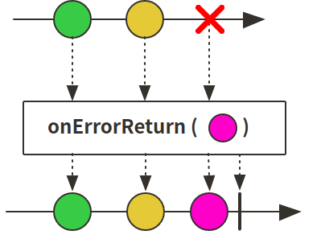
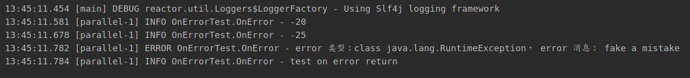
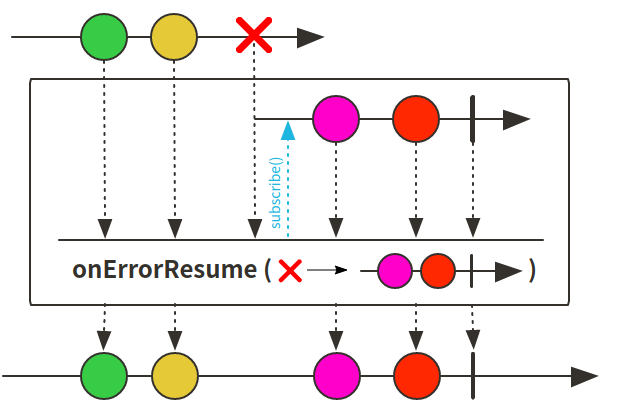
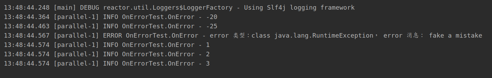
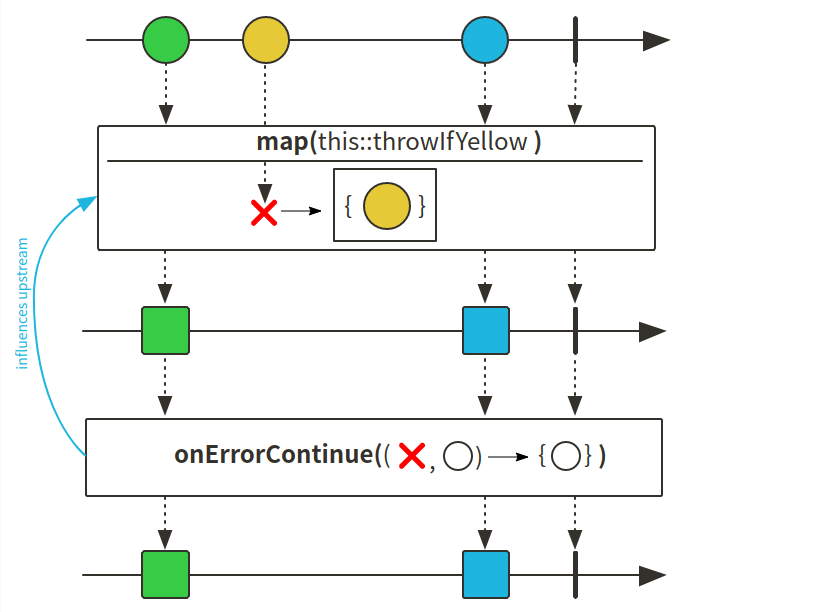
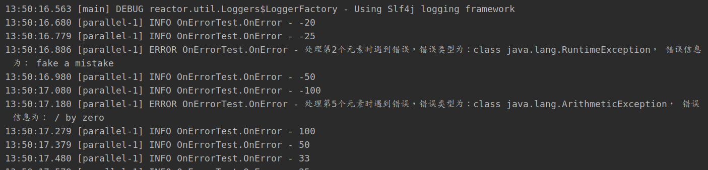
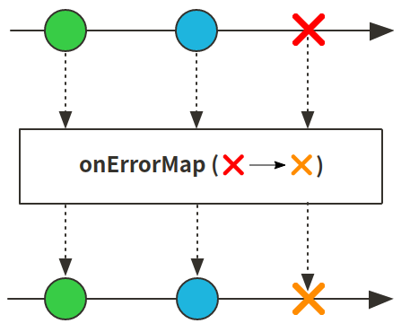
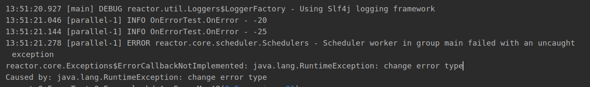

# Reactor 3 （5）: 错误处理 onError相关方法

数据在map等方法处理的过程中有可能会出现一些异常情况，如果出现异常需要进行处理reactor提供了几种处理error的方法：

+ onErrorReturn：出现错误直接返回默认值
+ onErrorResume：出现错误使用备用方案
+ onErrorContinue：出现错误跳过错误，使用原数据继续执行
+ onErrorMap：替换错误内容

### onErrorReturn使用




```java
    @Test
    public void onErrorReturn () {
        Flux.interval(Duration.ofMillis(100))
                .map(i -> {
                    if (i == 2) throw new RuntimeException("fake a mistake");
                    return String.valueOf(100/(i-5));
                })
                .doOnError(e -> log.error("error 类型：{}， error 消息： {}", e.getClass(),e.getMessage()))
                // 遇到error直接返回指定value， 错误类型判断可选
                .onErrorReturn("test on error return")
                .subscribe(log::info);

        try{
            Thread.sleep(2000);
        } catch (InterruptedException e) {
            e.printStackTrace();
        }
    }
```

执行结果，错误信息替换为指定内容：



### onErrorResume使用



```java
@Test
public void onErrorResume () {
    Flux.interval(Duration.ofMillis(100))
            .map(i -> {
                if (i == 2) throw new RuntimeException("fake a mistake");  // 设置两个错误，一个runtime错误，一个zero错误
                return String.valueOf(100/(i-5));
            })
            .doOnError(e -> log.error("error 类型：{}， error 消息： {}", e.getClass(),e.getMessage()))
            //一旦遇到error可以用来返回备选方案， 错误类型判断可选
            .onErrorResume(e -> Flux.range(1,3).map(String::valueOf))
            .subscribe(log::info);

    try{
        Thread.sleep(2000);
    } catch (InterruptedException e) {
        e.printStackTrace();
    }
}
```

执行，发生错误使用返回的新的publisher作为替换：



### onErrorContinue使用



```java
@Test
public void onErrorContinue () {
    Flux.interval(Duration.ofMillis(100))
            .map(i -> {
                if (i == 2) throw new RuntimeException("fake a mistake");
                return String.valueOf(100/(i-5));
            })
            // 遇到error之后跳过，可以通过不同错误类型做不同处理
            .onErrorContinue((err, val) -> log
                    .error("处理第{}个元素时遇到错误，错误类型为：{}， 错误信息为： {}", val, err.getClass(), err.getMessage()))
            .subscribe(log::info);

    try{
        Thread.sleep(2000);
    } catch (InterruptedException e) {
        e.printStackTrace();
    }
}
```

执行结果，跳过错误使用原publisher继续执行：



### onErrorMap使用



```java
@Test
public void onErrorMap () {
    Flux.interval(Duration.ofMillis(100))
            .map(i -> {
                if (i == 2) throw new RuntimeException("fake a mistake");
                return String.valueOf(100/(i-5));
            })
            // 当发生错误时更换错误内容
            .onErrorMap(e -> new RuntimeException("change error type"))
            .subscribe(log::info);

    try{
        Thread.sleep(2000);
    } catch (InterruptedException e) {
        e.printStackTrace();
    }
}
```

执行结果：更换了错误内容




[代码](https://github.com/ffzs/learn_reactor/tree/master/src/main/java/OnErrorTest)