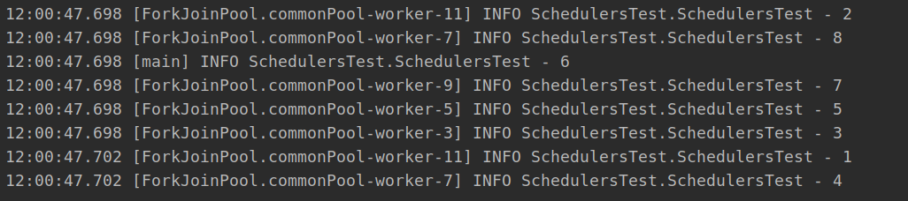
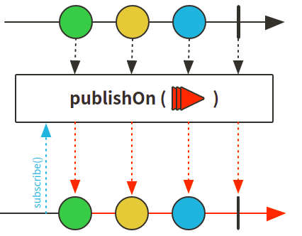
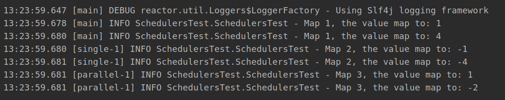
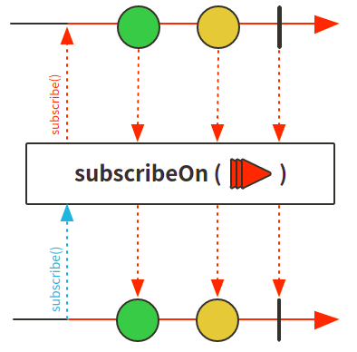
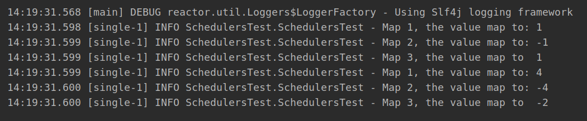
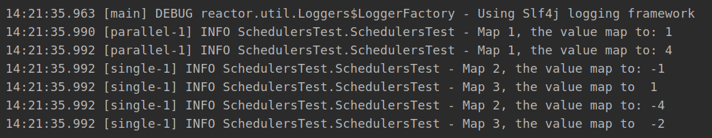

# Reactor 3 （9）: 并发和调度器 Schedulers、publishOn、subscribeOn


Stream中的并行处理非常简单，只要加上parallel()，就可以将stream并行化：

```java
    @Test
    public void streamParallel () {
        Stream.of(1,2,3,4,5,6,7,8).parallel().map(String::valueOf).forEach(log::info);
    }
}
```

根据结果中线程使用情况可知这种操作就完成了stream的并行化：




Reactor的并行化跟stream一样简单，不同于stream对并行的不可控，Reator还提供了可以对并行运行的调度器`Schedulers`

## Schedulers简介

在Reactor中，并行执行以及执行的位置由所`Scheduler`确定 。

Schedulers 类有如下几种对上下文操作的静态方法：

+ **immediate()**：无执行上下文，提交的**Runnable**将直接在原线程上执行，可以理解没有调度
+ **single()**：可重用单线程，使用一个线程处理所有请求
+ **elastic()**： 没有边界的弹性线程池
+ **boundedElastic()**：有边界弹性线程池，设置线程限制，默认为cpu核心数*10。达到上限后最多可以提交10万个任务。是阻塞线程的方法
+ **parallel()**: 固定线程数量的并行线程池，线程数量和cpu内核一样多


Reactor 提供了两种通过**Scheduler**切换上下文执行的方法：publishOn`和`subscribeOn。

+ publishOn在执行顺序中的位置很重要
+ subscribeOn的位置不重要

## publishOn方法



+ publishOn可以用来切换执行链中上下文执行模式

### 测试代码：

```java
@Test
public void publishOnTest() {
    Flux.range(1,2)
            .map(i -> {
                log.info("Map 1, the value map to: {}", i*i);
                return i*i;
            })
            .publishOn(Schedulers.single())
            .map(i -> {
                log.info("Map 2, the value map to: {}", -i);
                return -i;
            })
            .publishOn(Schedulers.newParallel("parallel", 4))
            .map(i -> {
                log.info("Map 3, the value map to: {}", i+2);
                return (i+2) + "";
            })
            .subscribe();
}
```

### 运行结果：



+ 从结果可以看出，每次运行publishOn之后就切换了线程

## subscribeOn方法



有图可见subscribeOn使用之后会全方位覆盖，因此如果出现多个subscribeOn()，回执行后触发的

```java
@Test
public void subscribeOnTest() throws InterruptedException {
    Flux.range(1,2)
            .map(i -> {
                log.info("Map 1, the value map to: {}", i*i);
                return i*i;
            })
            .subscribeOn(Schedulers.single())
            .map(i -> {
                log.info("Map 2, the value map to: {}", -i);
                return -i;
            })
            .subscribeOn(Schedulers.newParallel("parallel", 4))
            .map(i -> {
                log.info("Map 3, the value map to  {}", i+2);
                return (i+2) + "";
            })
            .subscribe();

    Thread.sleep(100);
}
```



由结果可见，subscribe是反向处理，因此先触发parallel，后触发single，因此都是使用的single


## subscribeOn和publishOn混合使用

看个例子代码：

```java
    @Test
    public void subscribeOnTest() throws InterruptedException {
        Flux.range(1,2)
                .map(i -> {
                    log.info("Map 1, the value map to: {}", i*i);
                    return i*i;
                })
                .publishOn(Schedulers.single())
                .map(i -> {
                    log.info("Map 2, the value map to: {}", -i);
                    return -i;
                })
                .subscribeOn(Schedulers.newParallel("parallel", 4))
                .map(i -> {
                    log.info("Map 3, the value map to  {}", i+2);
                    return (i+2) + "";
                })
                .subscribe();

        Thread.sleep(100);
    }
```



+ 优先触发subscribeOn，使用parallel覆盖之后所有过程
+ 当执行完map1后
+ 触发了publishOn，因此该publishOn之后的所有都更换了Schedulers
+ 因此之后的map2,map3都是publishOn的single


代码


