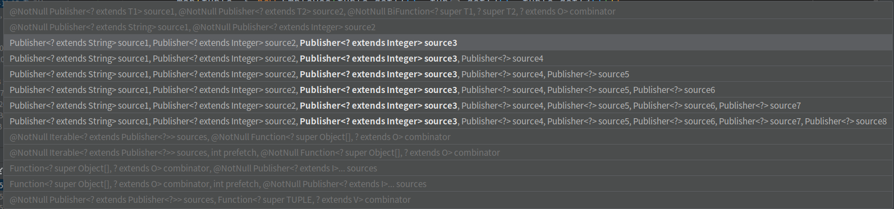
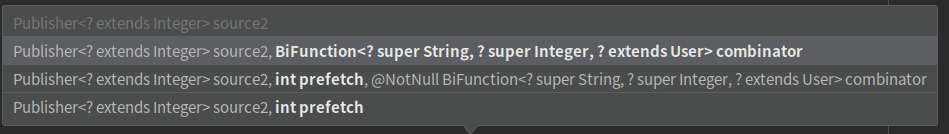
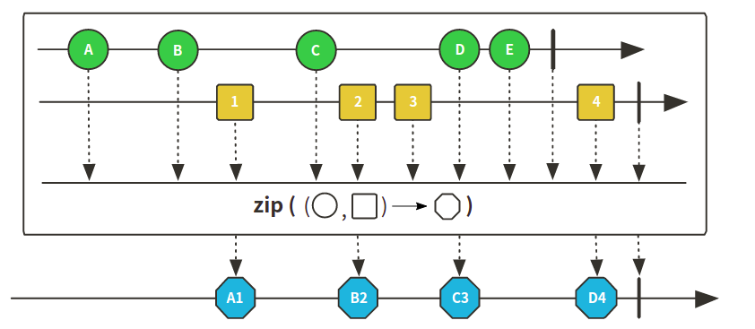
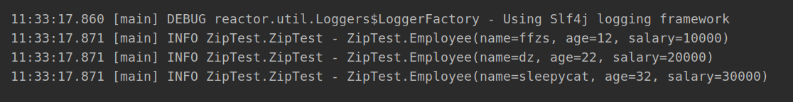
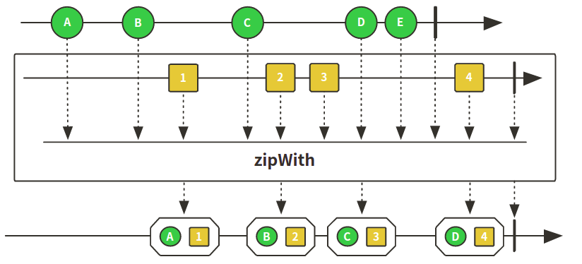
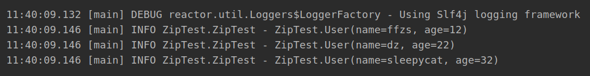

# Reactor 3 （11）: 数据压缩zip、zipWith

处理业务的时候一定有这样的需求：将多个源数据压缩成一个，Reactor提供了zip和zipWith方法可以做到这一点。

zip和zipwith有些不同：

+ zip可以一次合并多个源
+ 
+ zipWiht一次只能合并两个
+ 

+ zipWiht支持prefectch


## zip、zipWiht方法测试

### 准备数据

```java
private Flux<String> name () {
    return Flux.just("ffzs", "dz", "sleepycat");
}

private Flux<Integer> age () {
    return Flux.just(12, 22, 32);
}

private Flux<Integer> salary () {
    return Flux.just(10000, 20000, 30000);
}

@Data
@AllArgsConstructor
static class Employee {
    String name;
    Integer age;
    Integer salary;
}

@Data
@AllArgsConstructor
static class User {
    String name;
    Integer age;
}
```

### zip方法使用

多个源压缩到一起，等待所有源发出一个元素之后，将这些元素进行组合

图示：



+ 如果是输入publisher会将多个源自动转化为tuple类型

```java
    @Test
    public void zipTest () {
        Flux<Tuple3<String, Integer, Integer>> flux = Flux.zip(name(), age(), salary());
        flux.subscribe(i -> log.info(i.toString()));
    }
```

+ 将数据转化为类
+ tuple 通过getT1这类方法获取数据

```java
@Test
public void zipTest () {
    Flux<Tuple3<String, Integer, Integer>> flux = Flux.zip(name(), age(), salary());
    Flux<Employee> employee = flux.map(tuple -> new Employee(tuple.getT1(), tuple.getT2(), tuple.getT3()));
    employee.subscribe(i -> log.info(i.toString()));
}
```



+ 再zip中可以直接给出合并器

```java
@Test
public void zipCombineTest () {
    Flux<Employee>  flux = Flux.zip(objects -> {
        return new Employee((String)objects[0], (Integer)objects[1], (Integer)objects[2]);
    }, name(), age(), salary());
    flux.subscribe(i -> log.info(i.toString()));
}
```


### zipWith用法

图示：



跟with方法差不多，只能处理两个源：

```java
@Test
public void zipWithTest () {
    Flux<User> flux = name().zipWith(age(), (name, age) -> new User(name, age));
    flux.subscribe(i -> log.info(i.toString()));
}
```



## 代码

github